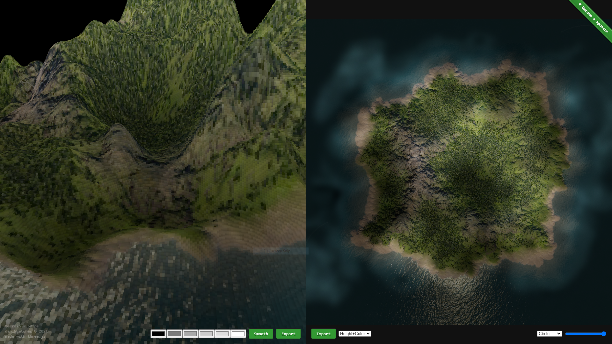

[terrain](https://terrain.gatunes.com/)
==

[](https://terrain.gatunes.com/)

> A fast heightmap based voxelizer

### NPM package

[three-terrain](https://www.npmjs.com/package/three-terrain) [](https://www.npmjs.com/package/three-terrain) 

#### Editor

```bash
# clone this repo
git clone https://github.com/danielesteban/terrain.git
cd terrain
# install dev dependencies
npm install
# start the dev environment:
npm start
# Open http://localhost:8080/ in your browser
```
